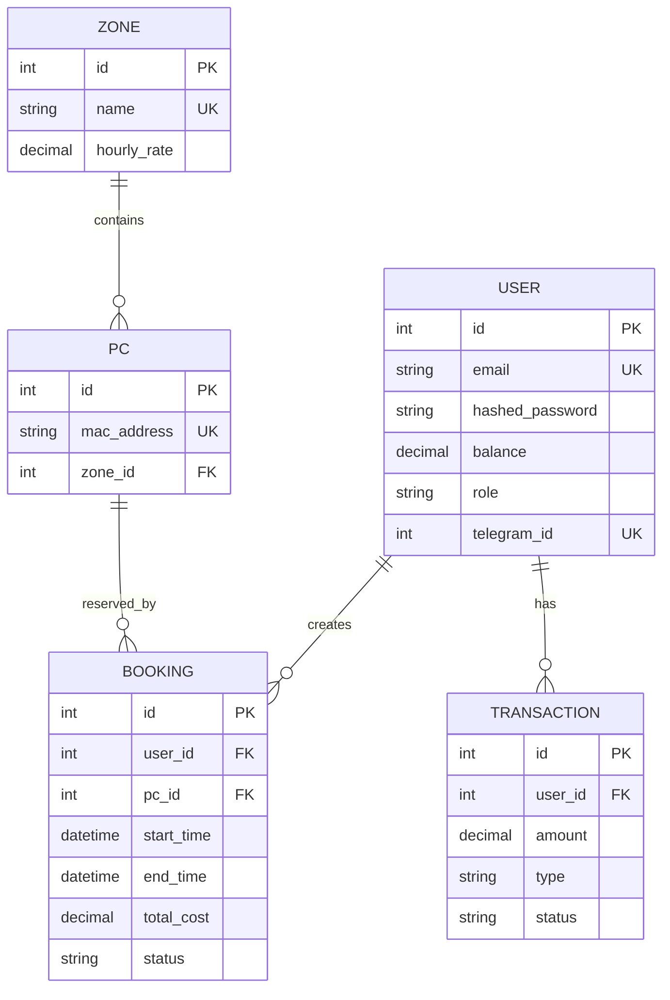

# 🎮 Computer Club Booking System

[](https://www.python.org/)
[](https://fastapi.tiangolo.com/)
[](https://www.postgresql.org/)
[](https://redis.io/)
[](https://docs.celeryq.dev/)
[](https://www.docker.com/)
[](https://pytest.org/)
[](https://www.sqlalchemy.org/)

A production-ready, fully-featured computer club management platform with **real-time monitoring**, **hybrid authentication**, **Telegram bot integration**, and **payment processing**. Built with async Python and modern DevOps practices.

---

## 🚀 About The Project

This is an enterprise-grade booking system designed for gaming/computer clubs. It provides a complete ecosystem for managing infrastructure, reservations, payments, and customer interactions through multiple channels:

- **RESTful API** — Core backend with FastAPI and async SQLAlchemy
- **Admin Panel** — Real-time club monitoring with WebSockets and live status map
- **Telegram Bot** — Customer-facing interface with Stripe payment integration
- **Background Workers** — Automated session management and notifications

**Key Metrics:**
- 61% test coverage with 37 tests (integration + unit)
- 97% coverage on core booking service
- Supports concurrent bookings with pessimistic locking
- WebSocket-powered real-time updates

---

## ✨ Key Features

### 👥 For Administrators

#### 🗺️ **Live Club Map (WebSocket-powered)**
- Real-time PC status visualization
- Countdown timers for active sessions
- One-click session termination
- Cash payment processing at reception desk

#### 🔐 **Hybrid Authentication**
- **Session-based auth** for browser (sqladmin with cookies)
- **JWT tokens** for API and Telegram bot
- Seamless admin experience across interfaces

#### 💰 **Cash Booking System**
- Create instant bookings for walk-in customers
- Bypass payment gateway for cash transactions
- Automatic session tracking and cost calculation

#### 📊 **Management Dashboard**
- User account management
- Zone and PC configuration
- Booking history and analytics
- CRUD operations for all entities

### 🎮 For Customers

#### 🤖 **Telegram Bot Integration**
- Browse available PCs by zone and time
- Create bookings directly from Telegram
- Receive booking confirmations and reminders
- **Stripe Invoice** integration for secure payments

#### ⏰ **Smart Notifications**
- 15-minute reminder before session ends
- Email receipts with booking details
- Real-time status updates via WebSockets

#### 💳 **Flexible Payment Options**
- Stripe payment processing (online)
- Cash payments at reception (admin-initiated)
- Balance-based system with transaction history

---

## 🛠 Technology Stack

### Core Backend
- **FastAPI** — Modern async Python web framework
- **SQLAlchemy 2.0** — Async ORM with full type hints
- **PostgreSQL 15** — Primary database with asyncpg driver
- **Redis 7** — Caching, session storage, and Celery broker
- **Pydantic** — Data validation and settings management

### Background Processing
- **Celery 5.6** — Distributed task queue
- **Celery Beat** — Periodic task scheduler
- **asyncpg** — High-performance PostgreSQL driver

### Real-time & Integrations
- **WebSockets** — Live admin panel updates
- **aiogram 3.28** — Telegram Bot API framework
- **Stripe API** — Payment processing
- **SMTP** — Email notifications

### Testing & Quality
- **pytest** — Test framework with async support
- **pytest-cov** — Coverage reporting (61% overall, 97% on booking service)
- **httpx** — Async HTTP client for API testing
- **AsyncMock** — Isolated unit testing

### Infrastructure
- **Docker Compose** — Multi-container orchestration
- **Alembic** — Database migrations
- **GitHub Actions** — CI/CD pipeline

---

## 🏗 Architecture

### Three-Layer Architecture

```
┌─────────────────────────────────────────────────────┐
│                  API Layer (FastAPI)                 │
│  ┌─────────────┐  ┌─────────────┐  ┌──────────────┐│
│  │  Endpoints  │  │  WebSockets │  │  Admin Panel ││
│  │  (REST API) │  │  (Real-time)│  │  (sqladmin)  ││
│  └─────────────┘  └─────────────┘  └──────────────┘│
└─────────────────────────────────────────────────────┘
                         ▼
┌─────────────────────────────────────────────────────┐
│              Service Layer (Business Logic)          │
│  ┌──────────────┐  ┌──────────────┐  ┌────────────┐│
│  │   Booking    │  │     User     │  │  Payment   ││
│  │   Service    │  │   Service    │  │  Service   ││
│  └──────────────┘  └──────────────┘  └────────────┘│
└─────────────────────────────────────────────────────┘
                         ▼
┌─────────────────────────────────────────────────────┐
│            Repository Layer (Data Access)            │
│  ┌──────────────┐  ┌──────────────┐  ┌────────────┐│
│  │   Booking    │  │      PC      │  │    Zone    ││
│  │   Repository │  │  Repository  │  │ Repository ││
│  └──────────────┘  └──────────────┘  └────────────┘│
└─────────────────────────────────────────────────────┘
                         ▼
              ┌────────────────────┐
              │   PostgreSQL 15    │
              │  (Async with SQLA) │
              └────────────────────┘
```

### Service Architecture

```
┌──────────────────────────────────────────────────────────┐
│                     Docker Compose                        │
├──────────────────────────────────────────────────────────┤
│                                                           │
│  ┌─────────┐  ┌─────────┐  ┌─────────┐  ┌────────────┐ │
│  │   Web   │  │ Celery  │  │ Celery  │  │  Telegram  │ │
│  │ FastAPI │  │ Worker  │  │  Beat   │  │    Bot     │ │
│  └─────────┘  └─────────┘  └─────────┘  └────────────┘ │
│       │             │             │              │       │
│       └─────────────┴─────────────┴──────────────┘       │
│                          │                                │
│              ┌───────────┴───────────┐                   │
│              │                       │                    │
│         ┌────▼────┐           ┌─────▼─────┐             │
│         │ Postgre │           │   Redis   │             │
│         │   SQL   │           │  (Broker) │             │
│         └─────────┘           └───────────┘             │
└──────────────────────────────────────────────────────────┘
```

### Key Design Patterns

- **Repository Pattern** — Isolated data access layer
- **Dependency Injection** — FastAPI's built-in DI system
- **Service Layer** — Business logic separation from controllers
- **Unit of Work** — SQLAlchemy session management
- **Pessimistic Locking** — Race condition prevention (`SELECT FOR UPDATE`)

---

## 🔐 Security Features

### Hybrid Authentication System

```python
# Session-based (Browser/Admin Panel)
✓ Cookie-based authentication via sqladmin
✓ Secure session management with Redis

# JWT-based (API/Telegram Bot)
✓ Access + Refresh token pair
✓ Token rotation on refresh
✓ bcrypt password hashing
```

### Additional Security Measures
- **CORS** protection with strict origin whitelist
- **SQL Injection** prevention via SQLAlchemy ORM
- **Input validation** with Pydantic models
- **Environment variables** for sensitive credentials
- **UTC-only** timestamps to prevent timezone attacks

---

## 🐳 Quick Start (Docker)

### Prerequisites
- Docker & Docker Compose installed
- Git

### 1. Clone the repository

```bash
git clone https://github.com/bogdankirich/fast_api_pc_booking_system.git
cd fast_api_pc_booking_system
```

### 2. Configure environment

```bash
cp .env.example .env
```

Edit `.env` and configure:

```env
# Database
POSTGRES_USER=postgres
POSTGRES_PASSWORD=your_secure_password
POSTGRES_DB=booking_db
POSTGRES_HOST=db
POSTGRES_PORT=5432

# JWT
SECRET_KEY=your_secret_key_here
ALGORITHM=HS256
ACCESS_TOKEN_EXPIRE_MINUTES=30
REFRESH_TOKEN_EXPIRE_DAYS=7

# Redis & Celery
CELERY_BROKER_URL=redis://redis:6379/0
CELERY_RESULT_BACKEND=redis://redis:6379/0

# Telegram Bot
TELEGRAM_BOT_TOKEN=your_telegram_bot_token

# Stripe (optional)
STRIPE_SECRET_KEY=sk_test_...
STRIPE_PUBLISHABLE_KEY=pk_test_...
STRIPE_WEBHOOK_SECRET=whsec_...

# Email (optional)
SMTP_HOST=smtp.gmail.com
SMTP_PORT=465
SMTP_USER=your-email@gmail.com
SMTP_PASSWORD=your-app-password

# Base URL
BASE_URL=http://localhost:8000
```

### 3. Start all services

```bash
docker compose up --build -d
```

### 4. Verify installation

- **API Docs:** http://localhost:8000/docs
- **Admin Panel:** http://localhost:8000/admin
- **API Base:** http://localhost:8000

### 5. Apply database migrations

```bash
docker compose exec web alembic upgrade head
```

### 6. Create admin user (optional)

```bash
docker compose exec web python -c "
from app.db.database import SessionLocal
from app.models.user import User
from app.core.security import hash_password

db = SessionLocal()
admin = User(
    email='admin@example.com',
    hashed_password=hash_password('admin123'),
    role='admin'
)
db.add(admin)
db.commit()
print('Admin user created!')
"
```

---

## 🧪 Running Tests

The project includes comprehensive test coverage with integration and unit tests.

### Run all tests

```bash
docker compose exec web pytest -v
```

### Run with coverage report

```bash
docker compose exec web pytest --cov=app --cov-report=term-missing
```

### Run specific test categories

```bash
# Integration tests only
docker compose exec web pytest -m integration -v

# Unit tests only
docker compose exec web pytest -m unit -v

# Smoke tests (critical paths)
docker compose exec web pytest -m smoke -v
```

### Test Structure

```
tests/
├── api/                          # Integration tests
│   ├── test_admin_bookings.py   # Admin panel endpoints (15 tests)
│   ├── test_bookings.py         # Booking flow tests
│   ├── test_auth.py             # Authentication tests
│   └── test_stripe.py           # Payment integration tests
├── services/                     # Unit tests
│   └── test_booking_service.py  # Service layer (22 tests, 97% coverage)
└── tg_bot/                       # Telegram bot tests
    ├── test_api_client.py
    └── test_auth.py
```

### Test Coverage

| Module | Coverage | Tests |
|--------|----------|-------|
| `app/services/booking.py` | 97% | 22 unit tests |
| `app/api/endpoints/bookings.py` | 73% | 15 integration tests |
| **Overall Project** | 61% | 37 tests total |

---

## 📂 Project Structure

```
pc_booking_system/
├── app/
│   ├── admin/              # Admin panel (sqladmin)
│   │   ├── auth_admin.py   # Admin authentication
│   │   └── views.py        # Live map & CRUD views
│   ├── api/
│   │   ├── endpoints/      # REST API routes
│   │   │   ├── auth.py
│   │   │   ├── bookings.py
│   │   │   ├── pcs.py
│   │   │   ├── users.py
│   │   │   ├── websockets.py
│   │   │   └── zones.py
│   │   └── dependencies/   # Dependency injection
│   ├── core/
│   │   ├── celery_app.py   # Celery configuration
│   │   ├── config.py       # Settings management
│   │   ├── security.py     # JWT & password utils
│   │   └── websockets.py   # WebSocket manager
│   ├── db/
│   │   └── database.py     # Database session factory
│   ├── models/             # SQLAlchemy ORM models
│   │   ├── bookings.py
│   │   ├── pc.py
│   │   ├── transactions.py
│   │   ├── user.py
│   │   └── zone.py
│   ├── repositories/       # Data access layer
│   │   ├── base.py
│   │   ├── booking.py
│   │   ├── pc.py
│   │   ├── user.py
│   │   └── zone.py
│   ├── schemas/            # Pydantic models
│   │   ├── booking.py
│   │   ├── pc.py
│   │   ├── user.py
│   │   └── zone.py
│   ├── services/           # Business logic
│   │   ├── booking.py      # 97% test coverage
│   │   ├── payment.py
│   │   ├── pc.py
│   │   ├── user.py
│   │   └── zone.py
│   ├── tasks/              # Celery tasks
│   │   ├── bookings.py     # Session expiry
│   │   ├── email.py        # Email notifications
│   │   └── telegram_notifications.py
│   └── main.py             # FastAPI app entry point
├── tg_bot/                 # Telegram bot (aiogram)
│   ├── handlers/
│   ├── keyboards/
│   ├── api_client.py
│   └── main.py
├── tests/                  # Test suite
│   ├── api/                # Integration tests
│   ├── services/           # Unit tests
│   └── conftest.py         # Test fixtures
├── alembic/                # Database migrations
├── docker-compose.yml      # Service orchestration
├── Dockerfile
├── requirements.txt
└── pyproject.toml          # Pytest configuration
```

---

## 📡 API Documentation

### Authentication

| Method | Endpoint | Access | Description |
|--------|----------|--------|-------------|
| `POST` | `/api/v1/users/` | Public | Register new user |
| `POST` | `/api/v1/login` | Public | Login (get JWT tokens) |
| `POST` | `/api/v1/refresh` | Public | Refresh access token |
| `GET` | `/api/v1/users/me` | User | Get current user profile |

### Zones & PCs

| Method | Endpoint | Access | Description |
|--------|----------|--------|-------------|
| `GET` | `/api/v1/zones/` | User | List all zones |
| `POST` | `/api/v1/zones/` | Admin | Create new zone |
| `GET` | `/api/v1/pcs/` | User | List all PCs |
| `GET` | `/api/v1/pcs/available` | User | Find available PCs by time |
| `POST` | `/api/v1/pcs/` | Admin | Add new PC |

### Bookings (User)

| Method | Endpoint | Access | Description |
|--------|----------|--------|-------------|
| `POST` | `/api/v1/bookings/` | User | Create new booking |
| `GET` | `/api/v1/bookings/` | User | List own bookings |
| `DELETE` | `/api/v1/bookings/{id}` | User/Admin | Cancel booking |

### Bookings (Admin)

| Method | Endpoint | Access | Description |
|--------|----------|--------|-------------|
| `POST` | `/api/v1/bookings/admin/cash-booking` | Admin | Create cash booking (walk-in) |
| `POST` | `/api/v1/bookings/admin/end-session` | Admin | Terminate active session by PC ID |

### WebSocket

| Endpoint | Description |
|----------|-------------|
| `WS /ws/pc-status` | Real-time PC status updates for admin panel |

**Interactive Docs:** http://localhost:8000/docs

---

## ⚙️ Environment Variables

### Required

```env
POSTGRES_USER           # Database username
POSTGRES_PASSWORD       # Database password
POSTGRES_DB            # Database name
POSTGRES_HOST          # Database host (use 'db' in Docker)
POSTGRES_PORT          # Database port (5432)

SECRET_KEY             # JWT signing key
ALGORITHM              # JWT algorithm (HS256)

CELERY_BROKER_URL      # Redis URL for Celery broker
CELERY_RESULT_BACKEND  # Redis URL for results

TELEGRAM_BOT_TOKEN     # Telegram Bot API token
```

### Optional

```env
ACCESS_TOKEN_EXPIRE_MINUTES  # Default: 30
REFRESH_TOKEN_EXPIRE_DAYS    # Default: 7

STRIPE_SECRET_KEY            # Stripe payment key
STRIPE_PUBLISHABLE_KEY       # Stripe public key
STRIPE_WEBHOOK_SECRET        # Stripe webhook signing secret

SMTP_HOST                    # Email server host
SMTP_PORT                    # Email server port (465/587)
SMTP_USER                    # Email username
SMTP_PASSWORD                # Email password

BASE_URL                     # API base URL for callbacks
```

---

## 🗺 Database Schema



---

## 🔄 Key Workflows

### 1. Creating a Booking (User Flow)

```
1. User selects PC and time slot via Telegram bot
2. Bot calls GET /api/v1/pcs/available?zone_id=X&start=...&end=...
3. User confirms booking
4. Bot sends Stripe Invoice
5. User pays → Stripe webhook notifies backend
6. Backend creates booking via POST /api/v1/bookings/
7. Service layer:
   ✓ Validates time (not in past, min 15 min duration)
   ✓ Checks PC availability (pessimistic lock)
   ✓ Calculates cost from zone hourly_rate
   ✓ Deducts balance
   ✓ Creates booking record
8. Celery sends email receipt
9. Celery schedules 15-min reminder
10. WebSocket broadcasts PC status change to admin
```

### 2. Cash Booking (Admin Flow)

```
1. Customer arrives at reception
2. Admin opens Live Map in browser
3. Admin clicks "Cash Booking" on available PC
4. Enters duration (hours)
5. POST /api/v1/bookings/admin/cash-booking
6. Service creates booking for guest user
7. WebSocket updates map (PC shows as occupied with timer)
8. Session starts immediately
```

### 3. Early Session Termination

```
1. Admin sees active session on Live Map
2. Clicks "End Session" button
3. POST /api/v1/bookings/admin/end-session {pc_id: X}
4. Service finds active booking for that PC
5. Cancels booking, PC becomes available
6. WebSocket broadcasts status change
7. Map updates in real-time
```

---

## 🤖 Telegram Bot Commands

### User Commands

- `/start` — Welcome message and registration
- `/login` — Link Telegram account with website profile
- `/book` — Start booking flow (zone → PC → time)
- `/my_bookings` — View active bookings
- `/profile` — Check balance and account info

### Bot Features

- Inline keyboards for easy navigation
- Stripe Invoice integration for payments
- Redis-based FSM (Finite State Machine) for booking flow
- Automatic JWT token refresh
- Error handling with user-friendly messages

---

## 📊 Monitoring & Observability

### Health Checks

```bash
# PostgreSQL
docker compose exec db pg_isready -U postgres

# Redis
docker compose exec redis redis-cli ping

# Web API
curl http://localhost:8000/docs

# Celery Worker
docker compose logs celery_worker --tail=50
```

### Logs

```bash
# All services
docker compose logs -f

# Specific service
docker compose logs -f web
docker compose logs -f celery_worker
docker compose logs -f bot
```

---

## 🔮 Roadmap

### In Progress
- [x] Hybrid authentication (JWT + Session)
- [x] Live admin map with WebSockets
- [x] Cash booking system
- [x] Telegram bot with Stripe
- [x] 97% test coverage on booking service

### Planned Features
- [ ] Analytics dashboard for admins
- [ ] Revenue reports and charts
- [ ] SMS notifications (Twilio)
- [ ] Loyalty program / discount system
- [ ] PC hardware monitoring integration
- [ ] Mobile app (React Native)
- [ ] Multi-language support
- [ ] Dark mode for admin panel

### Technical Improvements
- [ ] Prometheus metrics export
- [ ] Grafana dashboards
- [ ] Rate limiting with Redis
- [ ] GraphQL API endpoint
- [ ] Kubernetes deployment manifests
- [ ] OpenAPI schema validation

---

## 🤝 Contributing

Contributions are welcome! Please follow these steps:

1. Fork the repository
2. Create a feature branch (`git checkout -b feature/amazing-feature`)
3. Commit your changes (`git commit -m 'feat: add amazing feature'`)
4. Push to the branch (`git push origin feature/amazing-feature`)
5. Open a Pull Request

### Development Setup

```bash
# Install dependencies
pip install -r requirements.txt

# Run linters
ruff check .
mypy app/

# Format code
black app/ tests/
isort app/ tests/

# Run tests before committing
pytest -v --cov=app
```

---

## 📜 License

This project is licensed under the MIT License - see the [LICENSE](LICENSE) file for details.

---

## 📬 Contact & Support

**Bohdan Kirichenko** — Backend Python Developer

- 📧 Email: [bogdankirich1337@gmail.com](mailto:bogdankirich1337@gmail.com)
- 💼 LinkedIn: [Bogdan Kirichenko](https://www.linkedin.com/in/bogdan-kirichenko-a8486b333/)
- 🐙 GitHub: [@bogdankirich](https://github.com/bogdankirich)

---

## 🙏 Acknowledgments

- [FastAPI](https://fastapi.tiangolo.com/) — Modern async web framework
- [SQLAlchemy](https://www.sqlalchemy.org/) — Powerful ORM
- [Celery](https://docs.celeryq.dev/) — Distributed task queue
- [aiogram](https://docs.aiogram.dev/) — Elegant Telegram Bot framework
- [sqladmin](https://aminalaee.dev/sqladmin/) — Admin panel for SQLAlchemy

---

<div align="center">

**⭐ Star this repo if you find it useful!**

Made with ❤️ by [Bohdan Kirichenko](https://github.com/bogdankirich)

</div>
